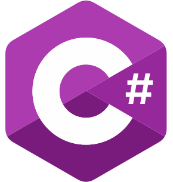

# Bienvenidos al repositorio tortuguil

## Estudiante de programación multiplataforma en el [CIFP Virgen de Gracia](https://cifpvirgendegracia.com)
## Amante de las tortugas
## Aprendiendo Java, C# y Python

  

## Actualmente dando cursos de Unity de mano de [Juan Gabriel Gomila](https://github.com/joanby)

<!---
Alfreditto/Alfreditto is a ✨ special ✨ repository because its `README.md` (this file) appears on your GitHub profile.
You can click the Preview link to take a look at your changes.
--->
